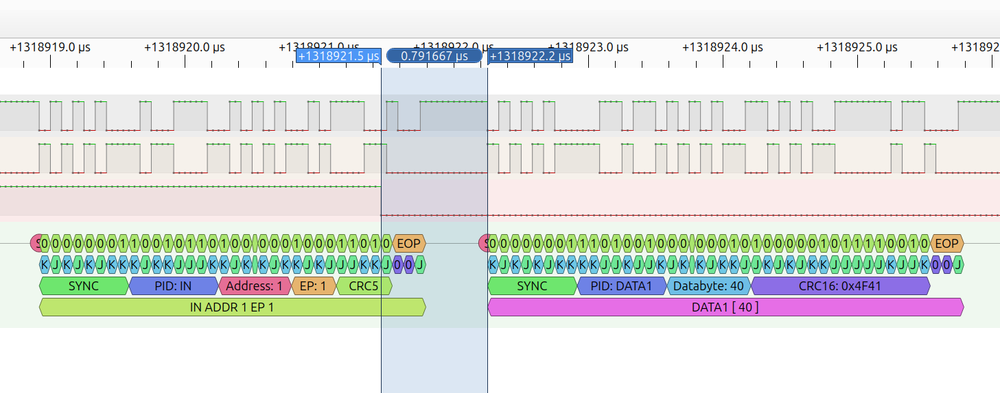

# Zero Latency Gamepad

This repository contains code for a very low latency game controller firmware that runs on boards with the RP2040 and RP2350 chips like the Raspberry Pi Pico and Pico 2.

Low latency is achieved by constantly writing the current GPIO pin state to the outgoing USB buffer via a DMA transfer from a PIO program. This way the inputs that are sent out always come from a very recent sampling of GPIO pin state.

The report descriptor of the controller is written so that a single byte represents the state of 8 buttons that the controller exposes to the host. Limiting the input report's size to one byte means that the DATA transfer is also shorter, further reducing the controller's latency.

The controller has 8 generic buttons, no analog sticks or triggers and no d-pad, you can however use it in real games by setting it up in Steam, mapping the buttons that it does have to the functions needed by your game.

Wire your buttons to GPIO0-GPIO7 pins.

See the [latest release](https://github.com/jfedor2/zero-latency-gamepad/releases/latest) for firmware downloads.

(A previous version of this project used the Pico-PIO-USB library to achieve a similar result and it required some custom wiring. This version uses the native USB port on the chip.)

## How fast is it?

I think it's within a microsecond or two of what's physically possible on Full Speed USB.

Using a pre-release version of [my latency tester](https://github.com/jfedor2/latency-tester), I'm getting 504.4us average latency (button press to end of DATA packet).

## How to compile

```
git clone https://github.com/jfedor2/zero-latency-gamepad.git
cd zero-latency-gamepad
git submodule update --init
mkdir build
cd build
PICO_BOARD=pico cmake ..
make
```


