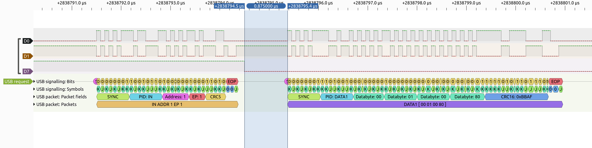

# Zero Latency Gamepad POC

This is proof-of-concept code for a very low latency game controller firmware for the Raspberry Pi Pico and other boards with the RP2040 chip.

It uses a modified version of the [Pico-PIO-USB](https://github.com/sekigon-gonnoc/Pico-PIO-USB) library to read the inputs state at the last possible moment before the USB data transfer happens. It also overclocks the RP2040 chip to 240 MHz to make sure the processing happens fast enough and the transfer doesn't time out.

Because it uses the PIO implementation and not the native USB interface of the RP2040, you have to wire a second USB port to the board. Wire GPIO0 to the USB D+ line, GPIO1 to the USB D- line, VBUS to VBUS and GND to GND. Additionally put a 1.5k pull-up resistor between GPIO0 and the 3.3V pin.

You still flash the firmware using the regular USB port, but when you want to use it as a gamepad, connect to the second port that you added.

The rest of the GPIO pins can be used for buttons and D-pad.


## How fast is it?

I think it's within a microsecond or two of what's physically possible on Full Speed USB. Below you can see output from a logic analyzer showing that a button press happens 875 nanoseconds before the data transfer starts and it is reflected in the input report sent.

(Technically, since the first two fields of the data packet are known in advance, we could push it a little bit further and read the inputs state even after the transfer starts. Let me know if you can pull that off.)



## But what's the average latency?

Because of the way the USB protocol works, average latency really isn't a good way of thinking about input device performance. The way it works is it's the host that decides at which time it wants the data transfer to happen. It sends an "IN" packet to the device and then it has a very short time to respond with the input report. If a button press happens 0.8ms before the host polls for input, there's nothing the device can do to speed it up, it has to wait for the host for the data transfer to happen.

Therefore it makes more sense to ask: how late can the button press happen before the data transfer and still be reflected in the input report sent?

## How to compile

```
git clone https://github.com/jfedor2/zero-latency-gamepad.git
cd zero-latency-gamepad
git submodule update --init
mkdir build
cd build
cmake ..
make
```
